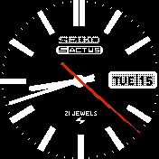

# Seiko 5actus

This is based on Seiko 5Actus That I really like for its clear display. The seconds hand being red allows for the hours and minute
hands to be read easier.

The Second hand being visible for only a minute then switches off means that the battery life is extended considerably.
Producing minute update also improves the readability.

The images and display has not changed from the original and all credit to the designer.

This watch face works in both the light and dark themes but I personally think it looks a lot cleaner in the dark them.

This watch whilst technically designed in a way that would work with the BangleJs has been only listed to work with the BangleJs2, if someones wants to test it on a first gen and let me know if it works then i'll allow it to be installed on both devices but I assume with how the images have been designed it would look strange on a first gen watch.

Special thanks to:
* Daniel Cox for Seiko 5Actus
* rozek (for his updated widget draw code for utilization with background images)
* Gordon Williams (Bangle.js, watchapps for reference code and documentation)
* The community (for helping drive such a wonderful project)
